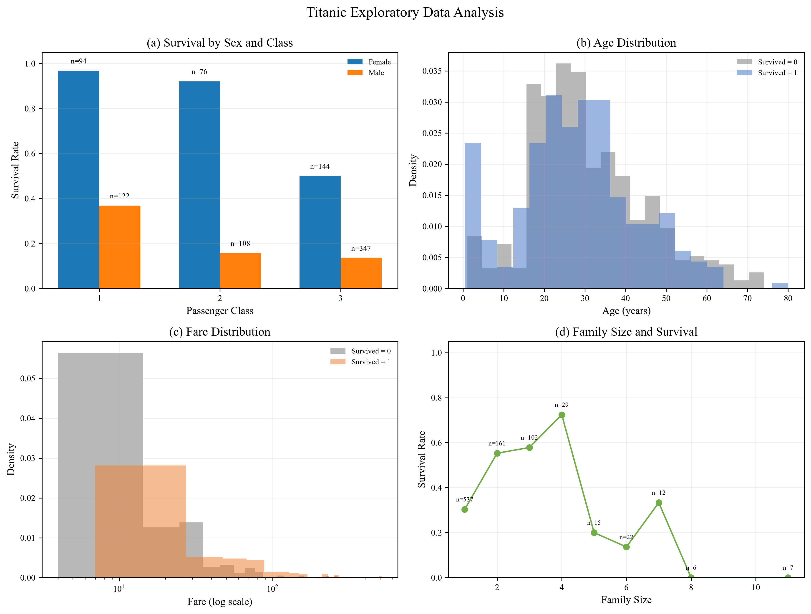
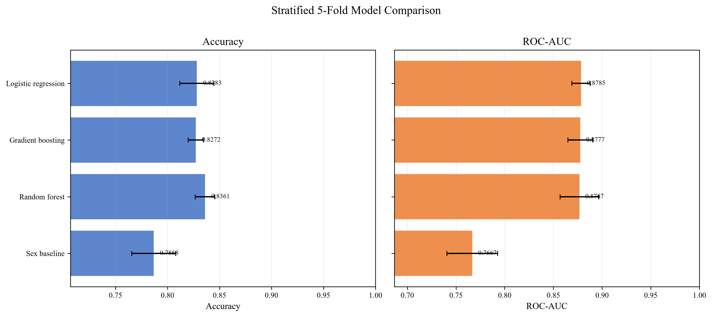
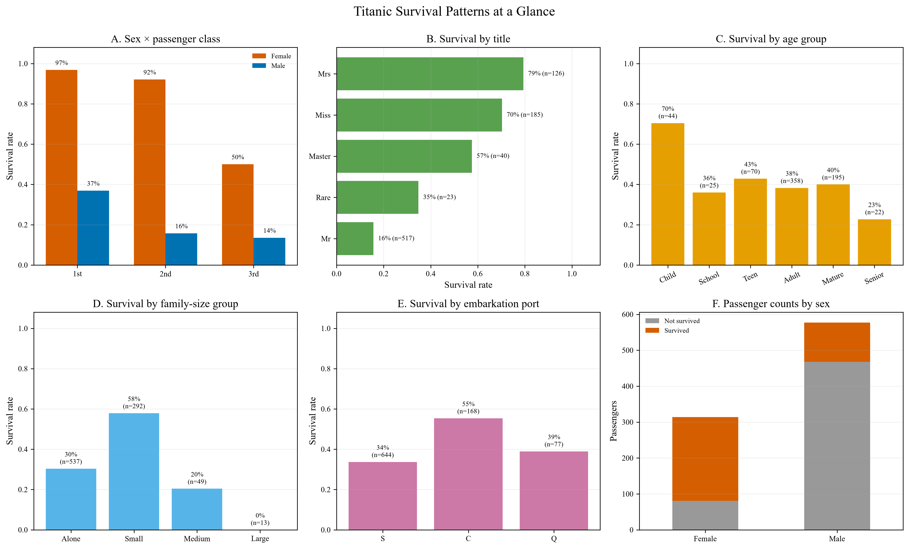
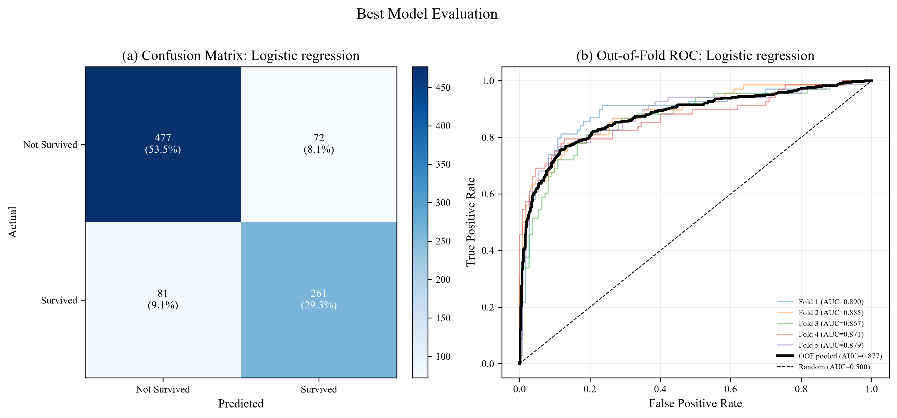
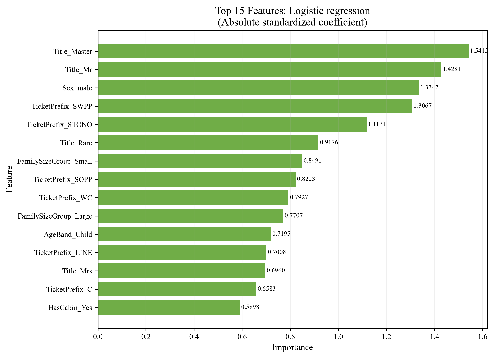

# 题目二：Kaggle 泰坦尼克号生存预测

本文件按照 [Machine-Learning-Practice/题目二](https://github.com/YileWang-Lab/Machine-Learning-Practice/tree/main/%E9%A2%98%E7%9B%AE%E4%BA%8C) 的要求完成。题目配套的 `train.csv`、`test.csv` 和 `gender_submission.csv` 已从仓库下载到本目录的 `data/` 下。

## 1. 数据与建模流程

- 训练集：891 行，生还 342 人，训练集生还率 38.38%
- 测试集：418 行，PassengerId 为 892–1309
- 交叉验证：分层 5 折，`shuffle=True, random_state=42`
- 比较模型：性别基线、逻辑回归、随机森林、梯度提升
- 预处理：全部放在 `Pipeline` 与 `ColumnTransformer` 内，验证折只使用本折训练数据拟合

### 缺失值处理策略

| 列 | 处理方式 | 原因 |
|---|---|---|
| `Age` | 训练折中位数填充 | 年龄右偏且存在极端值，中位数比均值更稳健 |
| `Fare` | 训练折中位数填充 | 测试集有 1 个缺失值，保留该样本比删行更合适 |
| `Embarked` | 训练折众数填充 | 只有少量缺失，港口是名义变量 |
| `Cabin` | 先构造 `HasCabin`，再对分类变量用训练折众数填充 | 舱号缺失本身具有信息，是否有客舱记录比具体舱号更稳健 |
| 其他分类特征 | 训练折众数填充 | 保持样本数量，并通过 `handle_unknown='ignore'` 处理测试集新类别 |

不直接删除缺失行，是因为删除会减少本已不大的训练样本，并且测试集缺失模式与训练集不同；更重要的是，所有填充值都在 Pipeline 内按训练折计算，避免交叉验证信息泄漏。

## 2. 特征工程

| 新特征 | 含义 |
|---|---|
| `Title` | 从 `Name` 提取称谓；`Mlle/Ms` 合并为 `Miss`，`Mme` 合并为 `Mrs`，低频称谓合并为 `Rare` |
| `FamilySize` | `SibSp + Parch + 1`，表示同行家庭规模 |
| `IsAlone` | `FamilySize == 1` 时为 `Yes`，否则为 `No` |
| `HasCabin` | `Cabin` 是否有记录，作为客舱和社会阶层的代理变量 |
| `FareLog` | `log(1 + Fare)`，缓解票价的右偏分布 |
| `TicketPrefix` | 从 `Ticket` 提取字母前缀；无字母前缀归为 `NONE` |
| `AgeBand` | 将年龄划分为 Child、School、Teen、Adult、Mature、Senior |
| `FamilySizeGroup` | 将家庭规模划分为 Alone、Small、Medium、Large |

## 3. 模型比较结果

下表是训练集上的分层 5 折交叉验证结果；误差棒使用折间标准差，不除以 `sqrt(5)`。

| 模型 | Accuracy 均值 | Accuracy 标准差 | ROC-AUC 均值 | ROC-AUC 标准差 |
|---|---:|---:|---:|---:|
| 性别基线 | 0.7868 | 0.0210 | 0.7667 | 0.0261 |
| 逻辑回归 | 0.8283 | 0.0165 | **0.8785** | **0.0095** |
| 随机森林 | **0.8361** | 0.0094 | 0.8767 | 0.0199 |
| 梯度提升 | 0.8272 | 0.0073 | 0.8777 | 0.0128 |





## 3.1 直观生存模式

下面这张图把最容易解释的生存差异集中在一页：性别与舱位、称谓、年龄组、家庭规模、登船港口，以及男女乘客的实际人数构成。



从图中可以直接读出：女性生存率显著高于男性，而且一等舱女性接近 97%；`Mrs`、`Miss` 和 `Master` 的生存率高于 `Mr`；儿童组生存率最高。家庭规模为 2–4 人的小家庭生存率高于独自乘船或超大家庭，说明“有人同行”有帮助，但过大的家庭可能降低疏散效率。港口 C 的生存率较高，不过该组样本量明显小于港口 S，因此港口差异应谨慎解释。

## 4. 最终模型与选择理由

最终选择 **逻辑回归**。随机森林的准确率均值最高（0.8361），但与逻辑回归的折间误差棒存在重叠，准确率优势并不稳定；逻辑回归的 ROC-AUC 均值最高（0.8785），标准差最低（0.0095），说明概率排序能力更稳定。逻辑回归还具有标准化系数可解释、模型复杂度低的优点，因此在预测能力接近的情况下更适合作为最终提交模型。

使用全部训练集进行 out-of-fold 评估时：

- 混淆矩阵：`[[477, 72], [81, 261]]`
- OOF Accuracy：0.8283
- OOF ROC-AUC：0.8768



## 5. 特征重要性

逻辑回归的特征重要性使用**标准化后的系数绝对值**。前几项主要是 `Title_Master`、`Title_Mr`、`Sex_male` 和部分船票前缀，说明性别、称谓、船票类别以及家庭/客舱信息都提供了超出性别基线的有效信号。



## 6. 测试集提交结果

最终 `submission.csv` 已按 Kaggle 要求生成并检查：

- 两列：`PassengerId,Survived`
- 418 行预测数据
- PassengerId 与 `test.csv` 完全匹配且无重复
- `Survived` 只包含整数 0/1
- 预测生还人数：168 / 418
- 预测生还率：40.19%

测试集预测生还率比训练集的 38.38% 高约 1.81 个百分点，差异较小且合理；这是由于测试集的乘客构成和训练集存在抽样差异，并不表示模型使用了测试标签。

## 7. 代码说明与运行方式

主程序为 [`titanic_analysis.py`](titanic_analysis.py)，执行流程是：

1. 读取训练集与测试集，并构造 `Title`、`FamilySize`、`IsAlone`、`HasCabin`、`FareLog`、`TicketPrefix`、`AgeBand`、`FamilySizeGroup`。
2. 为每个模型建立包含缺失值填充、标准化和独热编码的 `Pipeline`。
3. 使用统一的 `StratifiedKFold` 比较 Accuracy 和 ROC-AUC。
4. 对最佳模型使用 `cross_val_predict` 生成全体训练样本的 out-of-fold 标签和概率，绘制混淆矩阵与 ROC 曲线。
5. 在全部训练集上重新拟合逻辑回归，输出特征重要性和测试集 `submission.csv`。

运行方式：

```powershell
pip install -r requirements.txt
python titanic_analysis.py
```

## 8. 文件清单

- [`titanic_analysis.py`](titanic_analysis.py)：完整分析代码
- [`submission.csv`](submission.csv)：418 行 Kaggle 提交文件
- [`figures/fig1_eda.png`](figures/fig1_eda.png)
- [`figures/fig2_model_comparison.png`](figures/fig2_model_comparison.png)
- [`figures/fig3_model_evaluation.png`](figures/fig3_model_evaluation.png)
- [`figures/fig4_feature_importance.png`](figures/fig4_feature_importance.png)
- [`model_metrics.csv`](model_metrics.csv)：交叉验证指标
- [`feature_importance.csv`](feature_importance.csv)：特征重要性
- [`titanic_summary.json`](titanic_summary.json)：机器可读摘要
- [`data/train.csv`](data/train.csv)、[`data/test.csv`](data/test.csv)：题目数据
